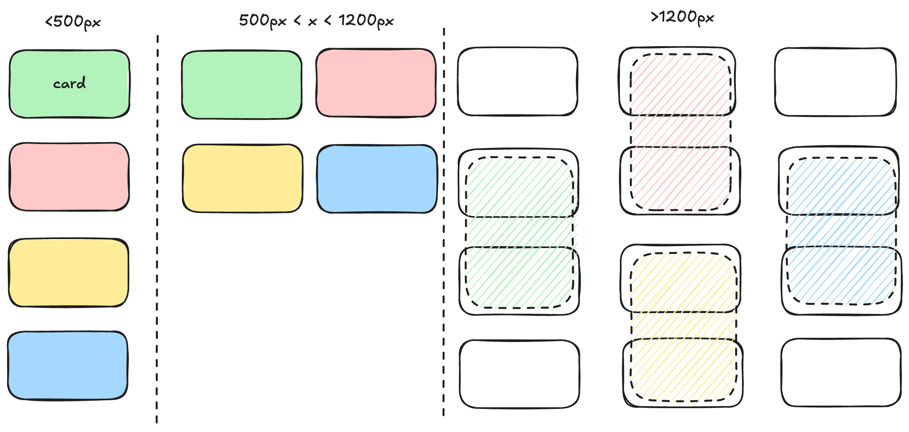

# Frontend Mentor - Four card feature section solution

This is a solution to the [Four card feature section challenge on Frontend Mentor](https://www.frontendmentor.io/challenges/four-card-feature-section-weK1eFYK). Frontend Mentor challenges help you improve your coding skills by building realistic projects.

## Table of contents

- [Overview](#overview)
  - [The challenge](#the-challenge)
  - [Screenshot](#screenshot)
  - [Links](#links)
- [My process](#my-process)
  - [Built with](#built-with)
  - [What I learned](#what-i-learned)
  - [Continued development](#continued-development)
  - [Useful resources](#useful-resources)

## Overview

### The challenge

Users should be able to:

- View the optimal layout for the site depending on their device's screen size

### Screenshot


### Links

- Solution URL: [solution URL here](https://github.com/coyoteshkw/frontend-mentor/tree/main/four-card-feature-section-master)
- Live Site URL: [live site URL here](https://coyoteshkw.github.io/frontend-mentor/four-card-feature-section-master/)

## My process

### Built with

- Semantic HTML5 markup
- CSS custom properties
- CSS Grid
- Mobile-first workflow

### What I learned

I used `clamp()` function. I'm not very good at using `vw` unit, but it worked well.

```css
.header__desc {
  font-size: clamp(1rem, calc(.3rem + 1vw), 1.5rem);
  margin-top: 1.625rem;
  color: var(--grayish-blue);
}
```

I learned CSS Grid by [this course](https://cssgrid.io/) and [this article](https://www.joshwcomeau.com/css/interactive-guide-to-grid/). And I use Grid layout to create responsive website. When smaller than 500px, only 1 column, and then 2 column, when larger than 1200px, using a special grid layout like this:



```css
.main {
  margin-top: 76px;
  display: grid;
  gap: 1.25rem;
  align-items: stretch;
  /* max-width: 385px;
  margin-inline: auto; */
  margin-inline: auto;
}

@media screen and (min-width: 500px) {
  .main {
    max-width: 846px;
    grid-template-columns: 1fr 1fr;
  }
}

@media screen and (min-width: 1200px) {
  .main {
    grid-template-columns: repeat(3, 1fr);
    grid-template-rows: repeat(4, 1fr);
    max-width: 1000px;
    /* margin-inline: auto; */
  }
```

the description in card has different line numbers. Leading to different height. I fixed it to 2 line height and 30ch width so always the same.(*But if the text exceeds two lines, there will still be problems, but I finally decided to do it this way. If there is a better way, please tell me*)

### Continued development

more and more responsive knowledge!

### Useful resources

- [An Interactive Guide to CSS Grid • Josh W. Comeau](https://www.joshwcomeau.com/css/interactive-guide-to-grid/)
- [CSS Grid](https://cssgrid.io/) - This build a good foundation for my Grid layout
