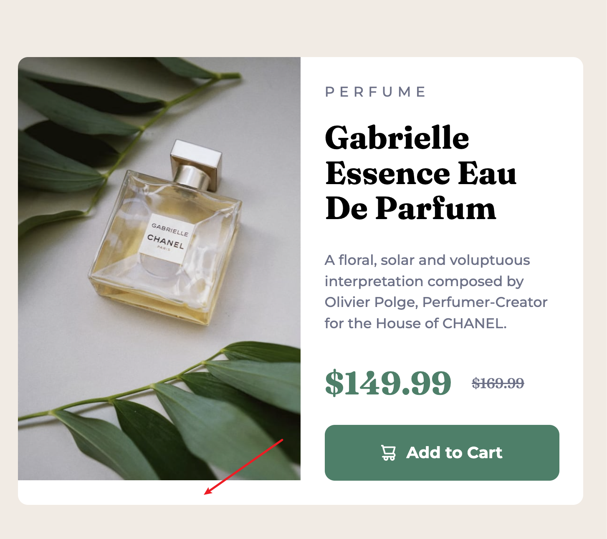

# Frontend Mentor - Product preview card component solution

This is a solution to the [Product preview card component challenge on Frontend Mentor](https://www.frontendmentor.io/challenges/product-preview-card-component-GO7UmttRfa). Frontend Mentor challenges help you improve your coding skills by building realistic projects.

## Table of contents

- [Overview](#overview)
  - [The challenge](#the-challenge)
  - [Screenshot](#screenshot)
  - [Links](#links)
- [My process](#my-process)
  - [Built with](#built-with)
  - [What I learned](#what-i-learned)
  - [Useful resources](#useful-resources)

## Overview

### The challenge

Users should be able to:

- View the optimal layout depending on their device's screen size
- See hover and focus states for interactive elements

### Screenshot


### Links

- Solution URL: [solution URL here](https://github.com/coyoteshkw/frontend-mentor/tree/main/product-preview-card-component-main)
- Live Site URL: [live site URL here](https://coyoteshkw.github.io/frontend-mentor/product-preview-card-component-main/)

## My process

### Built with

- Semantic HTML5 markup
- CSS custom properties
- Flexbox
- CSS Grid
- Mobile-first workflow

### What I learned

It's easy to create framework, but hard to handle the responsive picture.

I found that the image was very large, so by default it needed a lot of space to really center the card, so I used the extra margin of the body to highlight the card.

```css
body {
  display: flex;
  justify-content: center;
  align-items: center;
  /* creating space around card */
  margin: 1rem;

  background-color: var(--cream);
}
```

I think limiting the image size is a better option but I don't know how to do it. So what I did was just use **media queries and picture element** to switch to another image when it gets too big

```html
<div class="card__img">
  <picture>
    <source media="(min-width: 600px)" srcset="./images/image-product-desktop.jpg">
    
  </picture>
</div>
```

```css
@media screen and (min-width: 600px) {
  .card {
    display: grid;
    grid-template-columns: 1fr 1fr;
    max-width: 600px;
    max-height: 449px;
  }
}
```

And I use block rather than inline-block on this challenge's button, because it looks the same width as the parent element. I really like this button :D

```css
.card__button {
  display: flex;
  align-items: center;
  justify-content: center;
  gap: 10px;
  padding-block: 1rem;
  margin-top: 1.5rem;
  text-decoration: none;
  font-weight: 700;
  color: var(--white);
  background-color: var(--dark-cyan);
  border-radius: 10px;
  cursor: pointer;
}
```

When switching to the large screen layout I found that the margin of the main text part could not support the entire right half. I didn't know how to deal with em units, so I finally decided to use fixed width and height. I hope there is a better way, thank you very much



```css
@media screen and (min-width: 600px) {
  .card {
    max-width: 600px;
    max-height: 449px;
  }
}
```

Finally, it's stupid but use `min-height: 100vh` make flex/grid layout really center on vertical. Sometimes I forget it.

### Useful resources

- [responsive picture | web.dev](https://web.dev/learn/design/responsive-images?hl=zh-cn)
- [1-Line Layouts](https://1linelayouts.glitch.me/) - How to create common layouts with less code
- [typography | web.dev](https://web.dev/learn/design/typography?hl=zh-cn#scaling_text) - something about typography
